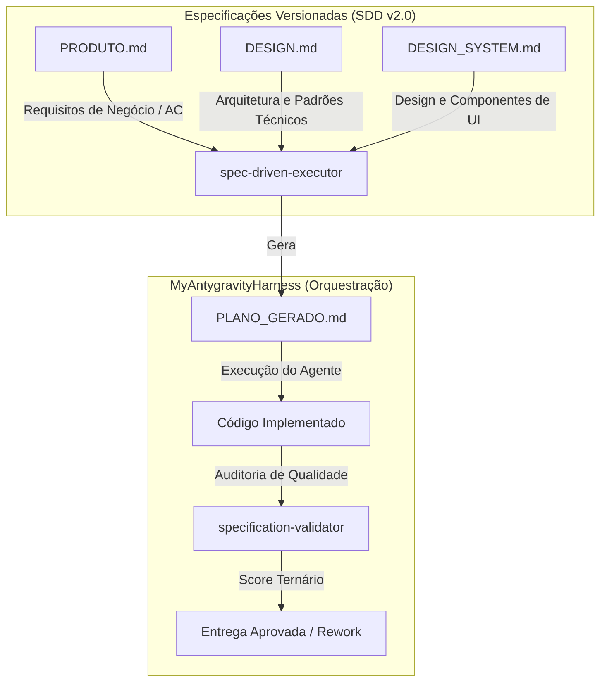

# MyAntygravityHarness

Harness de orquestração, governança e sandbox para execução controlada do agente autônomo Antigravity.

---

## 1. Visão Geral

O **MyAntygravityHarness** é um ecossistema projetado para atuar como o "harness" (arnês/estrutura de controle) do agente Antigravity. Ele provê as diretrizes de governança, o mapa de roteamento de skills e o fluxo de planejamento e execução baseados em especificações locais no repositório (**Spec-Driven Development — SDD v2.0**).



---

## 2. Estrutura do Repositório

```
MyAntygravityHarness/
├── .antigravity/          # Pasta padrão de configurações do Harness
│   ├── RebuildSDD/        # Especificações de arquitetura do rebuild
│   ├── skills/            # Definições de skills e scripts executáveis (.md / .py)
│   │   ├── spec-driven-executor.py
│   │   ├── specification-validator.py
│   │   └── test_integration.py
│   ├── templates/
│   │   └── _TEMPLATES/    # Modelos base das 3 especificações
│   │       ├── PRODUTO.md.template
│   │       ├── DESIGN.md.template
│   │       └── DESIGN_SYSTEM.md.template
│   └── README.md          # Esta documentação principal
├── SandBox/               # Diretório de execução local com permissão irrestrita
│   └── AgenteStoryteller/ # Projeto de teste e simulação de agente local
├── GEMINI.md              # Diretrizes do workspace e protocolo de validação
├── SKILLS_HIERARCHY.md    # Arquitetura visual de camadas e tabela de routing
├── SKILLS_ORCHESTRATION.yaml # Mapa de roteamento de skills e regras globais
└── .gitignore             # Arquivo de bloqueio de controle de versão
```

---

## 3. Arquitetura SDD v2.0 (Especificação Dirigida por Desenvolvimento)

O ecossistema implementa o protocolo de validação direcionada por especificações locais do projeto, dividindo o contrato em 3 dimensões imutáveis no repositório:

1. **`PRODUTO.md`**: Define o escopo funcional e os Critérios de Aceitação (AC) de negócio em formato de checkbox (`- [ ]`).
2. **`DESIGN.md`**: Especifica a arquitetura técnica de backend, stack, racional técnico, infraestrutura e restrições de performance e segurança.
3. **`DESIGN_SYSTEM.md`**: Detalha os tokens visuais, breakpoints, acessibilidade e biblioteca de componentes frontend base (Button, Input, Card, Modal, Navigation).

---

## 4. Skills de Orquestração do SDD

### 4.1 Spec-Driven Executor (`spec-driven-executor`)
Analisa as especificações do repositório atual, valida conflitos de tecnologia entre elas e gera automaticamente um plano de implementação estruturado de 8 seções obrigatórias:
- `SPEC_REFERENCES`
- `ACCEPTANCE_CRITERIA`
- `DESIGN_COMPLIANCE`
- `DESIGN_SYSTEM_COMPLIANCE`
- `CONFORMANCE_CHECKLIST`
- `PLANO_ATÔMICO`
- `VALIDAÇÃO_AUTOMÁTICA`
- `SUCCESS_SIGNATURE`

**Uso**:
```bash
python .antigravity/skills/spec-driven-executor.py [caminho/do/projeto]
```

### 4.2 Specification Validator (`specification-validator`)
Gate automático transversal de qualidade (camada L1) que faz a varredura do plano e das especificações do repositório, comparando os itens implementados e retornando uma pontuação ternária quantitativa:
- **AC Compliance**: Métrica de negócio.
- **Design Compliance**: Métrica técnica e de backend.
- **UI Compliance**: Métrica visual e de frontend.

**Uso**:
```bash
python .antigravity/skills/specification-validator.py [caminho/do/projeto]
```

---

## 5. Padrões de Qualidade e Governança

Todas as modificações de código neste repositório devem obedecer às seguintes diretrizes:
1. **Karpathy Core**: Simplicidade cirúrgica. Escrever apenas o código mínimo necessário para atender ao escopo atual, evitando Engenharia Reversa preditiva e limpezas estéticas em arquivos adjacentes.
2. **Impeccable QA**: Gate de qualidade obrigatório para auditoria estrutural e de conformidade.
3. **Session Log**: Governança e persistência de estado ativa ao final de cada jornada por meio da atualização do arquivo de histórico de sessão.
